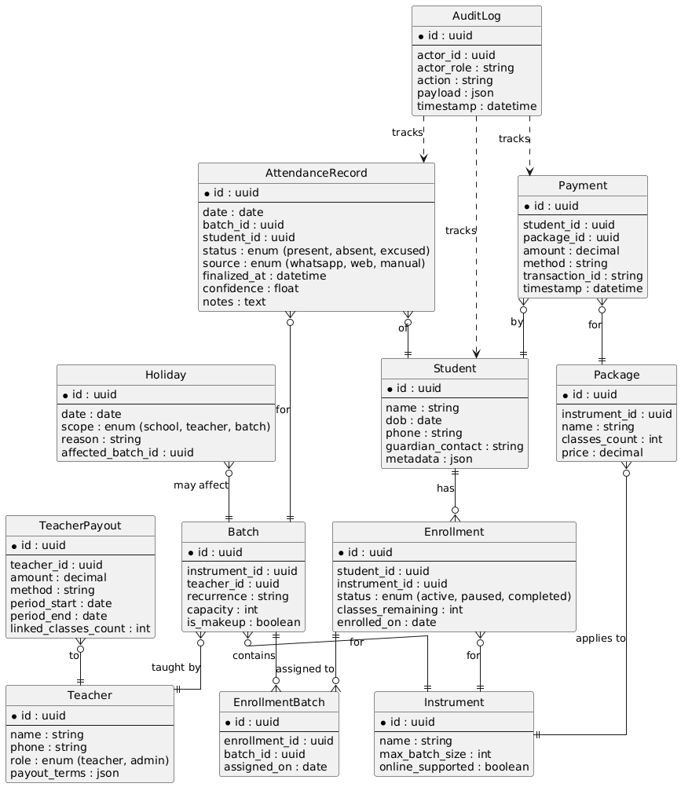

# ER Diagram — Hyderabad School of Music (HSM) 🗂️

This document describes the ER diagram for the MVP focused on Enrollment, Payments and Attendance (AI-assisted via WhatsApp).

## Files added
- `er_diagram.puml` — PlantUML source for the ER diagram.




## Entities & relationships (summary)
- Student — stores basic student details and contact info.
- Teacher — stores teacher profile and payout terms; teachers may also have admin role.
- Instrument — lists the streams (Keyboard, Guitar, Piano, Drums, Tabla, Violin, Hindustani & Carnatic vocals).
- Batch — recurring weekly slot (or makeup) linked to Instrument and Teacher; capacity enforced.
- Enrollment — student joins an instrument; tracks classes_remaining and status.
- EnrollmentBatch — assignment join table when a single Enrollment is assigned to multiple batches (students are typically in two weekly batches per instrument).
- AttendanceRecord — per-batch, per-student attendance record (status, source, finalized_at, confidence, notes).
- Package — prepaid product (Monthly = 8 classes, Quarterly = 24 classes).
- Payment — transaction applied to a student and specific package; updates classes_remaining.
- TeacherPayout — records payouts to teachers (supports fixed salary and per-class models).
- Holiday — school/teacher/batch-level holiday or leave records; when present, affected classes are not counted.
- AuditLog — stores change logs for payments, attendance finalization, and other key actions.

## How to render the PlantUML file
- Option A (locally): install PlantUML and Graphviz, then run:
  ```bash
  plantuml er_diagram.puml
  ```
  This generates `er_diagram.png` in the same folder.

- Option B (online): paste the contents of `er_diagram.puml` into https://plantuml.com/ or another PlantUML rendering service.

---

If you'd like, I can:
1) Render the diagram into a PNG/SVG and add it to the repo, or
2) Expand the diagram (add attributes, constraints, indices) into the database schema SQL.

Which would you like next? 🔧