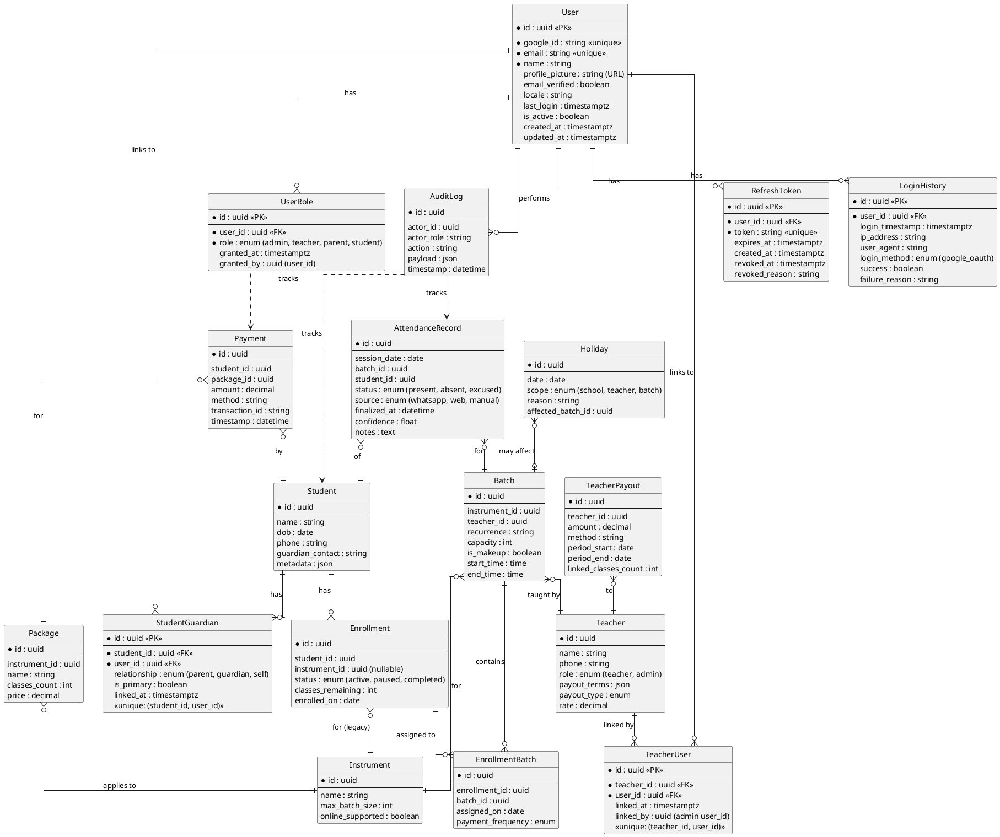

# Phase 2 Enhancement 1: Google OAuth & RBAC Design Document 🔐

**Version:** 1.0  
**Date:** 18 January 2026  
**Status:** Design Review  

---

## 📋 Table of Contents
1. [Overview](#overview)
2. [Updated ER Diagram](#updated-er-diagram)
3. [Authentication Flow](#authentication-flow)
4. [Authorization & Access Control](#authorization--access-control)
5. [Sequence Diagrams](#sequence-diagrams)
6. [Major Design Decisions](#major-design-decisions)
7. [Security Considerations](#security-considerations)
8. [Implementation Checklist](#implementation-checklist)

---

## Overview

### Goals
- Implement secure authentication using Google OAuth 2.0
- Establish role-based access control (RBAC) for three user types: Admin, Teacher, Student/Parent
- Protect all API endpoints with JWT-based authorization
- Create role-specific UI experiences in the frontend

### Non-Goals (Phase 2)
- Multi-factor authentication (MFA) - planned for Phase 3
- Password-based authentication - Google OAuth only
- Fine-grained permissions beyond role-based access
- Social login with Facebook/Microsoft - Google only

---

## Updated ER Diagram

### New Tables for Authentication & Authorization



### Database Schema Changes Summary

#### New Tables (5 tables)

1. **`users`** - Core user authentication table
   - Stores Google OAuth profile data
   - Central identity for all authenticated users
   - One-to-many relationship with roles

2. **`user_roles`** - Role assignments
   - Supports multiple roles per user (e.g., teacher who is also a parent)
   - Tracks who granted the role and when
   - Enum: `admin`, `teacher`, `parent`, `student`

3. **`teacher_users`** - Links users to teacher records
   - Enables teachers to log in and access their data
   - One teacher can have only one user account
   - One user can be linked to only one teacher record

4. **`student_guardians`** - Links users to student records
   - Enables parents/guardians to view student data
   - One student can have multiple guardians
   - One user can be guardian for multiple students
   - Tracks relationship type and primary contact

5. **`refresh_tokens`** - Token management
   - Stores refresh tokens for session management
   - Supports token revocation for security
   - Auto-cleanup of expired tokens

6. **`login_history`** - Audit trail
   - Tracks all login attempts (success and failures)
   - IP address and user agent for security monitoring
   - Helps identify suspicious activity

---

## Authentication Flow

### 1. Google OAuth 2.0 Login Flow

```
┌─────────┐          ┌──────────┐          ┌────────────┐          ┌──────────────┐
│ Browser │          │ Frontend │          │   Backend  │          │ Google OAuth │
└────┬────┘          └────┬─────┘          └─────┬──────┘          └──────┬───────┘
     │                    │                       │                        │
     │ 1. Click "Login    │                       │                        │
     │    with Google"    │                       │                        │
     ├───────────────────>│                       │                        │
     │                    │                       │                        │
     │                    │ 2. Redirect to        │                        │
     │                    │    Google OAuth       │                        │
     │                    ├───────────────────────┼───────────────────────>│
     │                    │                       │                        │
     │                    │                       │   3. User authenticates│
     │                    │                       │      & grants consent  │
     │                    │                       │                        │
     │                    │ 4. Callback with code │                        │
     │<───────────────────┼───────────────────────┼────────────────────────┤
     │                    │                       │                        │
     │ 5. POST /api/auth/ │                       │                        │
     │    google/callback │                       │                        │
     ├───────────────────>│─────────────────────>│                        │
     │                    │                       │                        │
     │                    │                       │ 6. Exchange code for   │
     │                    │                       │    access token        │
     │                    │                       ├───────────────────────>│
     │                    │                       │                        │
     │                    │                       │ 7. Return access token │
     │                    │                       │    & user profile      │
     │                    │                       │<───────────────────────┤
     │                    │                       │                        │
     │                    │                       │ 8. Check if user exists│
     │                    │                       │    in users table      │
     │                    │                       │    (by google_id)      │
     │                    │                       │                        │
     │                    │                       │ 9. If new: Create user │
     │                    │                       │    with role='parent'  │
     │                    │                       │                        │
     │                    │                       │ 10. Generate JWT       │
     │                    │                       │     (7 days expiry)    │
     │                    │                       │                        │
     │                    │                       │ 11. Generate refresh   │
     │                    │                       │     token (30 days)    │
     │                    │                       │                        │
     │                    │                       │ 12. Log login event    │
     │                    │                       │                        │
     │                    │ 13. Return JWT +      │                        │
     │                    │     refresh token +   │                        │
     │                    │     user profile      │                        │
     │                    │<──────────────────────┤                        │
     │                    │                       │                        │
     │ 14. Store tokens   │                       │                        │
     │     in localStorage│                       │                        │
     │<───────────────────┤                       │                        │
     │                    │                       │                        │
     │ 15. Redirect to    │                       │                        │
     │     dashboard      │                       │                        │
     │     (role-based)   │                       │                        │
     └────────────────────┘                       │                        │
                                                  │                        │
```

### 2. Authenticated API Request Flow

```
┌─────────┐          ┌──────────┐          ┌────────────┐          ┌──────────┐
│ Browser │          │ Frontend │          │   Backend  │          │ Database │
└────┬────┘          └────┬─────┘          └─────┬──────┘          └────┬─────┘
     │                    │                       │                      │
     │ 1. User action     │                       │                      │
     │    (e.g., view     │                       │                      │
     │    students)       │                       │                      │
     ├───────────────────>│                       │                      │
     │                    │                       │                      │
     │                    │ 2. GET /api/students  │                      │
     │                    │    Authorization:     │                      │
     │                    │    Bearer <JWT>       │                      │
     │                    ├──────────────────────>│                      │
     │                    │                       │                      │
     │                    │                       │ 3. authenticateJWT() │
     │                    │                       │    - Verify JWT      │
     │                    │                       │    - Check expiry    │
     │                    │                       │    - Extract user_id │
     │                    │                       │                      │
     │                    │                       │ 4. Query user +      │
     │                    │                       │    roles             │
     │                    │                       ├─────────────────────>│
     │                    │                       │                      │
     │                    │                       │ 5. Return user data  │
     │                    │                       │<─────────────────────┤
     │                    │                       │                      │
     │                    │                       │ 6. authorizeRole()   │
     │                    │                       │    - Check if user   │
     │                    │                       │      has required    │
     │                    │                       │      role (admin or  │
     │                    │                       │      teacher)        │
     │                    │                       │                      │
     │                    │                       │ 7. If teacher:       │
     │                    │                       │    Filter students   │
     │                    │                       │    by assigned       │
     │                    │                       │    batches only      │
     │                    │                       │                      │
     │                    │                       │ 8. Query filtered    │
     │                    │                       │    students          │
     │                    │                       ├─────────────────────>│
     │                    │                       │                      │
     │                    │                       │ 9. Return students   │
     │                    │                       │<─────────────────────┤
     │                    │                       │                      │
     │                    │ 10. Return response   │                      │
     │                    │<──────────────────────┤                      │
     │                    │                       │                      │
     │ 11. Display data   │                       │                      │
     │<───────────────────┤                       │                      │
     │                    │                       │                      │
```

### 3. Authorization Failure Flow

```
┌─────────┐          ┌──────────┐          ┌────────────┐
│ Browser │          │ Frontend │          │   Backend  │
└────┬────┘          └────┬─────┘          └─────┬──────┘
     │                    │                       │
     │                    │ GET /api/teachers     │
     │                    │ Authorization:        │
     │                    │ Bearer <JWT>          │
     │                    ├──────────────────────>│
     │                    │                       │
     │                    │                       │ authenticateJWT() ✓
     │                    │                       │ User role: 'parent'
     │                    │                       │
     │                    │                       │ authorizeRole(['admin'])
     │                    │                       │ ✗ Forbidden
     │                    │                       │
     │                    │ 403 Forbidden         │
     │                    │ {                     │
     │                    │   "error": "Access    │
     │                    │   denied. Admin role  │
     │                    │   required."          │
     │                    │ }                     │
     │                    │<──────────────────────┤
     │                    │                       │
     │ Show error toast   │                       │
     │ "Access Denied"    │                       │
     │<───────────────────┤                       │
     │                    │                       │
```

---

## Authorization & Access Control

### Role-Based Access Matrix

| Resource/Action | Admin | Teacher | Parent | Student |
|----------------|-------|---------|--------|---------|
| **Dashboard** | ✅ Full stats | ✅ Limited stats | ✅ Child-only stats | ✅ Self stats |
| **Students - View** | ✅ All students | ✅ Own batch students | ✅ Own children | ✅ Self only |
| **Students - Create** | ✅ | ❌ | ❌ | ❌ |
| **Students - Edit** | ✅ | ❌ | ⚠️ Own children (limited) | ⚠️ Self (limited) |
| **Students - Delete** | ✅ | ❌ | ❌ | ❌ |
| **Teachers - View** | ✅ | ✅ Self only | ❌ | ❌ |
| **Teachers - Manage** | ✅ | ❌ | ❌ | ❌ |
| **Batches - View** | ✅ All | ✅ Assigned only | ✅ Enrolled only | ✅ Enrolled only |
| **Batches - Manage** | ✅ | ❌ | ❌ | ❌ |
| **Attendance - View** | ✅ All, any date | ✅ Own batches, any date | ✅ Own children, any date | ✅ Self, any date |
| **Attendance - Mark** | ✅ All, any date | ✅ Own batches, today only | ❌ | ❌ |
| **Attendance - Edit** | ✅ | ❌ | ❌ | ❌ |
| **Payments - View** | ✅ All | ❌ | ✅ Own children | ✅ Self |
| **Payments - Record** | ✅ | ❌ | ❌ | ❌ |
| **Payouts - View** | ✅ All teachers | ✅ Self only | ❌ | ❌ |
| **Payouts - Process** | ✅ | ❌ | ❌ | ❌ |
| **User Management** | ✅ | ❌ | ❌ | ❌ |
| **Reports** | ✅ All data | ✅ Own data | ✅ Own children | ✅ Self |

### Page-Level Access Control

#### **Admin Access (Full System)**
- **Dashboard**: Complete statistics (all students, teachers, revenue, attendance rates)
- **Students Page**: CRUD operations on all students, enrollment management
- **Teachers Page**: CRUD operations on all teachers, payout management
- **Batches Page**: Create/edit/delete batches, capacity management
- **Attendance Page**: Mark/edit attendance for any batch, any date
- **Payments Page**: Record payments, generate invoices, view all transactions
- **Reports Page**: System-wide analytics, export data
- **Settings Page**: User management, role assignment, system configuration

#### **Teacher Access (Limited Management)**
- **Dashboard**: 
  - View: Own assigned batches, student count in own batches
  - View: Own monthly earnings, classes taught this month
  - View: Upcoming classes (today + next 7 days)
- **Students Page**:
  - **VIEW ONLY** for students enrolled in their assigned batches
  - See student contact info, enrollment details, attendance history
  - **NO CREATE/EDIT/DELETE** permissions
- **Attendance Page**:
  - Mark attendance for **own batches only**
  - **Restricted to today's date** (cannot backdate or future-date)
  - View historical attendance for own batches
- **Batches Page**:
  - **VIEW ONLY** for assigned batches
  - See schedule, enrolled students, batch capacity
- **My Profile**:
  - View own payout history
  - Edit own contact information

#### **Parent/Student Access (View-Only Portal)**
- **Student Portal**:
  - View student profile (name, instruments enrolled)
  - View current enrollment status
  - View **classes remaining** in current payment cycle
  - View attendance history (all dates)
  - View payment history and receipts
  - View upcoming classes schedule
  - Download invoices/receipts
- **Notifications**:
  - Receive class reminders via WhatsApp (Phase 2B)
  - Payment due reminders
- **Support**:
  - Contact admin form

### API Endpoint Protection

#### Authentication Middleware Chain
```javascript
// All API endpoints will use this pattern:
app.get('/api/students', 
  authenticateJWT,           // Verify JWT token, extract user
  authorizeRole(['admin', 'teacher']),  // Check role
  filterByRole,              // Apply data filtering based on role
  async (req, res) => { ... }
);
```

#### Endpoint-Role Mapping

| Endpoint | Admin | Teacher | Parent | Public |
|----------|-------|---------|--------|--------|
| `POST /api/auth/google` | - | - | - | ✅ |
| `GET /api/auth/profile` | ✅ | ✅ | ✅ | ❌ |
| `GET /api/students` | ✅ | ✅ (filtered) | ✅ (filtered) | ❌ |
| `POST /api/students` | ✅ | ❌ | ❌ | ❌ |
| `PUT /api/students/:id` | ✅ | ❌ | ❌ | ❌ |
| `DELETE /api/students/:id` | ✅ | ❌ | ❌ | ❌ |
| `GET /api/teachers` | ✅ | ✅ (self) | ❌ | ❌ |
| `POST /api/teachers` | ✅ | ❌ | ❌ | ❌ |
| `GET /api/batches` | ✅ | ✅ (filtered) | ✅ (filtered) | ❌ |
| `POST /api/batches` | ✅ | ❌ | ❌ | ❌ |
| `GET /api/attendance` | ✅ | ✅ (filtered) | ✅ (filtered) | ❌ |
| `POST /api/attendance` | ✅ | ✅ (today, own batches) | ❌ | ❌ |
| `PUT /api/attendance/:id` | ✅ | ❌ | ❌ | ❌ |
| `GET /api/payments` | ✅ | ❌ | ✅ (filtered) | ❌ |
| `POST /api/payments` | ✅ | ❌ | ❌ | ❌ |
| `GET /api/payouts` | ✅ | ✅ (self) | ❌ | ❌ |

---

## Sequence Diagrams

### A. First-Time User Registration

```
┌─────┐  ┌────────┐  ┌─────────┐  ┌────────┐  ┌──────────┐
│User │  │Frontend│  │ Backend │  │Database│  │  Google  │
└──┬──┘  └───┬────┘  └────┬────┘  └───┬────┘  └────┬─────┘
   │         │             │            │            │
   │ Click "Login         │            │            │
   │ with Google"         │            │            │
   ├────────>│             │            │            │
   │         │             │            │            │
   │         │ Redirect to Google      │            │
   │         ├────────────────────────────────────>│
   │         │             │            │            │
   │         │             │            │     Authenticate
   │         │             │            │            │
   │         │   Return OAuth code     │            │
   │         │<────────────────────────────────────┤
   │         │             │            │            │
   │         │ POST /auth/google/callback           │
   │         │   + code    │            │            │
   │         ├────────────>│            │            │
   │         │             │            │            │
   │         │             │ Exchange code for token │
   │         │             ├───────────────────────>│
   │         │             │            │            │
   │         │             │<─ user profile ─────────┤
   │         │             │            │            │
   │         │             │ SELECT * FROM users    │
   │         │             │ WHERE google_id = ?    │
   │         │             ├──────────>│            │
   │         │             │            │            │
   │         │             │<─ NULL ────┤  (not found)
   │         │             │            │            │
   │         │             │ INSERT INTO users      │
   │         │             │ (google_id, email,     │
   │         │             │  name, role='parent')  │
   │         │             ├──────────>│            │
   │         │             │            │            │
   │         │             │<─ user_id ─┤            │
   │         │             │            │            │
   │         │             │ INSERT INTO user_roles │
   │         │             │ (user_id, role='parent')│
   │         │             ├──────────>│            │
   │         │             │            │            │
   │         │             │ INSERT INTO login_history│
   │         │             ├──────────>│            │
   │         │             │            │            │
   │         │             │ Generate JWT           │
   │         │             │ (expires: 7d)          │
   │         │             │            │            │
   │         │             │ Generate refresh token │
   │         │             │ (expires: 30d)         │
   │         │             │            │            │
   │         │             │ INSERT INTO refresh_tokens│
   │         │             ├──────────>│            │
   │         │             │            │            │
   │         │<─ JWT + user profile ───┤            │
   │         │             │            │            │
   │<─ tokens│             │            │            │
   │   stored│             │            │            │
   │         │             │            │            │
   │ Redirect to          │            │            │
   │ /student-portal      │            │            │
   │         │             │            │            │
```

### B. Admin Links Teacher to User Account

```
┌─────┐  ┌────────┐  ┌─────────┐  ┌────────┐
│Admin│  │Frontend│  │ Backend │  │Database│
└──┬──┘  └───┬────┘  └────┬────┘  └───┬────┘
   │         │             │            │
   │ Navigate to         │            │
   │ "User Management"   │            │
   ├────────>│             │            │
   │         │             │            │
   │         │ GET /api/users           │
   │         │ (unlinked teachers)      │
   │         ├────────────>│            │
   │         │             │            │
   │         │             │ SELECT users, teachers│
   │         │             │ WHERE NOT IN teacher_users│
   │         │             ├──────────>│            │
   │         │             │            │            │
   │         │<─ List of users & teachers─┤         │
   │         │             │            │            │
   │ Select teacher       │            │            │
   │ "Ravi Kumar"         │            │            │
   │         │             │            │            │
   │ Select user          │            │            │
   │ "ravi@gmail.com"     │            │            │
   │         │             │            │            │
   │ Click "Link"         │            │            │
   ├────────>│             │            │            │
   │         │             │            │            │
   │         │ POST /api/users/link-teacher│         │
   │         │ {                       │            │
   │         │   teacher_id,           │            │
   │         │   user_id               │            │
   │         │ }           │            │            │
   │         ├────────────>│            │            │
   │         │             │            │            │
   │         │             │ BEGIN TRANSACTION      │
   │         │             │            │            │
   │         │             │ INSERT INTO teacher_users│
   │         │             │ (teacher_id, user_id,  │
   │         │             │  linked_by=admin_id)   │
   │         │             ├──────────>│            │
   │         │             │            │            │
   │         │             │ INSERT INTO user_roles │
   │         │             │ (user_id, role='teacher')│
   │         │             ├──────────>│            │
   │         │             │            │            │
   │         │             │ INSERT INTO audit_log  │
   │         │             │ (action='link_teacher')│
   │         │             ├──────────>│            │
   │         │             │            │            │
   │         │             │ COMMIT     │            │
   │         │             │            │            │
   │         │<─ Success ──┤            │            │
   │         │             │            │            │
   │<─ "Teacher linked successfully"   │            │
   │         │             │            │            │
```

### C. Teacher Marks Attendance (with Authorization Check)

```
┌────────┐  ┌────────┐  ┌─────────┐  ┌────────┐
│Teacher │  │Frontend│  │ Backend │  │Database│
└───┬────┘  └───┬────┘  └────┬────┘  └───┬────┘
    │           │             │            │
    │ Navigate to            │            │
    │ Attendance Tab         │            │
    ├──────────>│             │            │
    │           │             │            │
    │           │ GET /api/batches/my-today│
    │           │ Authorization: Bearer JWT│
    │           ├────────────>│            │
    │           │             │            │
    │           │             │ authenticateJWT()    │
    │           │             │ → Extract user_id    │
    │           │             │            │            │
    │           │             │ SELECT teacher_id    │
    │           │             │ FROM teacher_users   │
    │           │             │ WHERE user_id = ?    │
    │           │             ├──────────>│            │
    │           │             │            │            │
    │           │             │<─ teacher_id ─┤        │
    │           │             │            │            │
    │           │             │ SELECT batches       │
    │           │             │ WHERE teacher_id = ? │
    │           │             │ AND recurrence matches today│
    │           │             ├──────────>│            │
    │           │             │            │            │
    │           │<─ Today's batches ───────┤            │
    │           │             │            │            │
    │ Select batch           │            │            │
    │ "Keyboard 5pm"         │            │            │
    ├──────────>│             │            │            │
    │           │             │            │            │
    │           │ GET /api/batches/:id/students│       │
    │           ├────────────>│            │            │
    │           │             │            │            │
    │           │             │ authorizeRole(['teacher'])│
    │           │             │ + verifyBatchOwnership()│
    │           │             │            │            │
    │           │             │ SELECT students      │
    │           │             │ FROM enrollment_batches│
    │           │             │ WHERE batch_id = ?   │
    │           │             ├──────────>│            │
    │           │             │            │            │
    │           │<─ Student list ──────────┤            │
    │           │             │            │            │
    │ Mark attendance        │            │            │
    │ [Ravi: Present,        │            │            │
    │  Priya: Present,       │            │            │
    │  Neha: Absent]         │            │            │
    ├──────────>│             │            │            │
    │           │             │            │            │
    │           │ POST /api/attendance     │            │
    │           │ {                        │            │
    │           │   batch_id,              │            │
    │           │   date: today,           │            │
    │           │   records: [...]         │            │
    │           │ }           │            │            │
    │           ├────────────>│            │            │
    │           │             │            │            │
    │           │             │ authenticateJWT()      │
    │           │             │ authorizeRole(['teacher'])│
    │           │             │            │            │
    │           │             │ Verify:                │
    │           │             │ - date is today        │
    │           │             │ - batch belongs to user│
    │           │             │            │            │
    │           │             │ BEGIN TRANSACTION      │
    │           │             │            │            │
    │           │             │ INSERT attendance_records│
    │           │             ├──────────>│            │
    │           │             │            │            │
    │           │             │ UPDATE enrollments     │
    │           │             │ SET classes_remaining  │
    │           │             │ (decrement for present)│
    │           │             ├──────────>│            │
    │           │             │            │            │
    │           │             │ INSERT INTO audit_log  │
    │           │             │ (actor=teacher_id)     │
    │           │             ├──────────>│            │
    │           │             │            │            │
    │           │             │ COMMIT     │            │
    │           │             │            │            │
    │           │<─ Success ──┤            │            │
    │           │             │            │            │
    │<─ "Attendance saved"   │            │            │
    │           │             │            │            │
```

### D. Parent Views Student Portal

```
┌──────┐  ┌────────┐  ┌─────────┐  ┌────────┐
│Parent│  │Frontend│  │ Backend │  │Database│
└───┬──┘  └───┬────┘  └────┬────┘  └───┬────┘
    │         │             │            │
    │ Navigate to          │            │
    │ Student Portal       │            │
    ├────────>│             │            │
    │         │             │            │
    │         │ GET /api/portal/my-students│
    │         │ Authorization: Bearer JWT│
    │         ├────────────>│            │
    │         │             │            │
    │         │             │ authenticateJWT()    │
    │         │             │ → Extract user_id    │
    │         │             │            │            │
    │         │             │ SELECT student_id    │
    │         │             │ FROM student_guardians│
    │         │             │ WHERE user_id = ?    │
    │         │             ├──────────>│            │
    │         │             │            │            │
    │         │             │<─ [student_ids] ─┤    │
    │         │             │            │            │
    │         │             │ SELECT students,     │
    │         │             │   enrollments,       │
    │         │             │   batches            │
    │         │             │ WHERE student_id IN (?)│
    │         │             ├──────────>│            │
    │         │             │            │            │
    │         │<─ Student data with enrollments ──┤ │
    │         │             │            │            │
    │<─ Display:           │            │            │
    │   - Name: "Aarav"    │            │            │
    │   - Instruments: Keyboard, Guitar │            │
    │   - Classes left: 25 │            │            │
    │   - Next class: Tomorrow 5pm      │            │
    │         │             │            │            │
    │ Click "Attendance    │            │            │
    │ History"             │            │            │
    ├────────>│             │            │            │
    │         │             │            │            │
    │         │ GET /api/attendance?student_id=X    │
    │         ├────────────>│            │            │
    │         │             │            │            │
    │         │             │ authorizeRole(['parent'])│
    │         │             │ + verifyStudentAccess()│
    │         │             │   (check student_guardians)│
    │         │             │            │            │
    │         │             │ SELECT attendance_records│
    │         │             │ WHERE student_id = ?   │
    │         │             ├──────────>│            │
    │         │             │            │            │
    │         │<─ Attendance history ────┤            │
    │         │             │            │            │
    │<─ Display calendar   │            │            │
    │   with attendance    │            │            │
    │   (P/A markers)      │            │            │
    │         │             │            │            │
```

---

## Major Design Decisions

### Decision 1: Google OAuth Only (No Password Auth)

**Rationale:**
- Simplifies user management (no password storage, resets, complexity rules)
- Leverages Google's robust security infrastructure
- Most target users (parents, teachers) already have Gmail accounts
- Reduces attack surface (no password-based vulnerabilities)
- Faster implementation for MVP

**Trade-offs:**
- Users without Google accounts cannot use the system
- Dependency on Google's OAuth service availability
- Requires internet connection for login

**Mitigation:**
- For Phase 3, consider adding Microsoft/Apple OAuth as alternatives
- For users without Google: Admin can create accounts manually (future)

---

### Decision 2: JWT with Short Expiry (7 days) + Refresh Tokens (30 days)

**Rationale:**
- JWTs are stateless, reducing database load for auth checks
- Short expiry limits damage from stolen tokens
- Refresh tokens enable seamless re-authentication without repeated logins
- Standard industry practice for web apps

**Trade-offs:**
- JWTs cannot be revoked easily once issued
- Requires refresh token management and storage

**Mitigation:**
- Store refresh tokens in database with revocation capability
- Implement token rotation on refresh
- Add `jti` (JWT ID) for emergency token blacklisting

---

### Decision 3: Multi-Role Support (One User, Multiple Roles)

**Rationale:**
- Real-world scenario: A teacher can also be a parent of a student
- Avoids creating separate accounts for same person
- User can switch context (teacher view vs parent view)

**Implementation:**
- `user_roles` table supports multiple rows per user
- Frontend provides role switcher when user has multiple roles
- API responses include all roles, frontend filters UI accordingly

**Example:**
```javascript
// User has roles: ['teacher', 'parent']
// Dashboard shows:
// - Toggle: "View as Teacher" | "View as Parent"
// - Different data based on active role
```

---

### Decision 4: Database-Level Role Storage (Not in JWT)

**Rationale:**
- Roles can change (admin promotes user) without forcing re-login
- Enables immediate role revocation
- Single source of truth in database
- JWT only stores `user_id`, roles fetched on each request

**Trade-offs:**
- Extra database query on each authenticated request
- Slightly higher latency (~5-10ms)

**Mitigation:**
- Cache user roles in Redis for high-traffic scenarios (Phase 3)
- For MVP, direct database query is acceptable (< 100 concurrent users)

---

### Decision 5: Teacher Can Only Mark Today's Attendance

**Rationale:**
- Prevents backdating fraud (marking attendance for past classes that didn't happen)
- Encourages timely attendance submission
- Admin retains full flexibility for corrections

**Trade-offs:**
- Teacher cannot correct yesterday's attendance
- Requires admin intervention for legitimate backdating

**Mitigation:**
- Clear UI message: "Contact admin for attendance corrections"
- Admin has full attendance edit capabilities with audit logging

---

### Decision 6: Data Filtering at API Layer (Not Database Views)

**Rationale:**
- Flexible filtering logic in code (easier to modify)
- Single API endpoint for all roles, filter based on `req.user.role`
- Avoids complex database views and permission management

**Implementation:**
```javascript
// Middleware: filterByRole
async function filterStudents(req, res, next) {
  const { role, userId } = req.user;
  
  if (role === 'admin') {
    // No filter, return all students
    next();
  } else if (role === 'teacher') {
    // Filter: students in teacher's batches only
    const teacherId = await getTeacherIdFromUser(userId);
    req.studentFilter = { teacherId };
    next();
  } else if (role === 'parent') {
    // Filter: own children only
    const studentIds = await getChildrenIds(userId);
    req.studentFilter = { studentIds };
    next();
  } else {
    res.status(403).json({ error: 'Forbidden' });
  }
}
```

---

### Decision 7: Separate `teacher_users` and `student_guardians` Tables

**Rationale:**
- Clear separation of concerns
- One teacher can only link to one user (1:1)
- One student can have multiple guardians (1:N)
- One user can be guardian for multiple students (N:M)
- Enables tracking of relationship type (parent/guardian/self)

**Schema:**
```sql
-- 1:1 relationship (teacher to user)
teacher_users (teacher_id UNIQUE, user_id UNIQUE)

-- N:M relationship (students to users)
student_guardians (student_id, user_id, relationship, is_primary)
```

---

### Decision 8: Audit Logging for All Auth Events

**Rationale:**
- Security monitoring (detect brute force, suspicious logins)
- Compliance (track who did what, when)
- Debugging (trace user actions)
- Enhanced existing `audit_log` table to include auth events

**Events to log:**
- User login (success/failure)
- Role assignment/revocation
- Teacher/student linking
- Attendance marking by role
- Unauthorized access attempts

---

### Decision 9: Frontend Role-Based Routing

**Rationale:**
- Different landing pages for different roles
- Prevents unauthorized UI access (defense in depth)
- Better UX (teachers don't see irrelevant admin features)

**Implementation:**
```tsx
// After login, redirect based on role
if (user.roles.includes('admin')) {
  navigate('/admin/dashboard');
} else if (user.roles.includes('teacher')) {
  navigate('/teacher/dashboard');
} else {
  navigate('/student-portal');
}

// Protected routes
<ProtectedRoute allowedRoles={['admin']}>
  <TeacherManagement />
</ProtectedRoute>
```

---

### Decision 10: No MFA for MVP (Planned for Phase 3)

**Rationale:**
- MVP scope constraint
- Google OAuth already provides strong authentication
- MFA adds complexity to user onboarding

**Future Enhancement:**
- Phase 3: Add SMS/TOTP-based MFA for admin accounts
- Optional for teachers, parents

---

## Security Considerations

### 1. Token Security
- ✅ JWT secret stored in environment variables (never in code)
- ✅ HTTPS enforced in production (no token transmission over HTTP)
- ✅ HttpOnly cookies for refresh tokens (prevent XSS access)
- ✅ Short JWT expiry (7 days) limits exposure window
- ✅ Refresh token rotation (new token issued on refresh, old invalidated)

### 2. OAuth Security
- ✅ State parameter validation (prevent CSRF)
- ✅ Nonce validation (replay attack prevention)
- ✅ Redirect URI whitelist (prevent open redirect)
- ✅ Scope limitation (only request `profile` and `email`)

### 3. Authorization Security
- ✅ Defense in depth: Frontend hides UI + Backend enforces access
- ✅ Role verification on every API request (no trust in client)
- ✅ Data filtering at query level (users cannot guess IDs to access others' data)
- ✅ Audit logging for all sensitive operations

### 4. Database Security
- ✅ Prepared statements (prevent SQL injection)
- ✅ Unique constraints on `google_id`, `email` (prevent duplicate accounts)
- ✅ Foreign key constraints (maintain referential integrity)
- ✅ Soft deletes for users (set `is_active=false`, don't physically delete)

### 5. Rate Limiting (Phase 3)
- ⏳ Login endpoint: 5 attempts per 15 minutes per IP
- ⏳ API endpoints: 100 requests per minute per user

---

## Implementation Checklist

### Phase A: Database Schema (Week 1)
- [ ] Create migration `004_add_authentication_tables.sql`
- [ ] Add `users` table with Google OAuth fields
- [ ] Add `user_roles` table with enum('admin', 'teacher', 'parent', 'student')
- [ ] Add `teacher_users` linking table
- [ ] Add `student_guardians` linking table
- [ ] Add `refresh_tokens` table
- [ ] Add `login_history` table
- [ ] Create indexes on foreign keys
- [ ] Test migration on dev database

### Phase B: Backend Authentication (Week 1)
- [ ] Install: `passport`, `passport-google-oauth20`, `jsonwebtoken`, `express-session`
- [ ] Create `backend-enroll/auth/googleStrategy.js`
- [ ] Create `backend-enroll/auth/jwtMiddleware.js`
- [ ] Create `backend-enroll/auth/rbacMiddleware.js`
- [ ] Implement auth routes:
  - [ ] `GET /api/auth/google` (redirect to Google)
  - [ ] `GET /api/auth/google/callback` (handle OAuth callback)
  - [ ] `POST /api/auth/logout` (revoke refresh token)
  - [ ] `GET /api/auth/profile` (get current user)
  - [ ] `POST /api/auth/refresh` (refresh JWT)
- [ ] Add JWT generation/verification functions
- [ ] Add role-checking middleware
- [ ] Test with Postman/curl

### Phase C: Backend Authorization (Week 2)
- [ ] Protect all existing endpoints with `authenticateJWT`
- [ ] Add role checks to each endpoint
- [ ] Implement data filtering for teachers (own batches only)
- [ ] Implement data filtering for parents (own children only)
- [ ] Add audit logging for auth events
- [ ] Create admin-only endpoints:
  - [ ] `GET /api/admin/users` (list all users)
  - [ ] `POST /api/admin/users/link-teacher` (link user to teacher)
  - [ ] `POST /api/admin/users/link-guardian` (link user to student)
  - [ ] `PUT /api/admin/users/:id/role` (assign/revoke role)
- [ ] Test authorization matrix

### Phase D: Frontend Authentication (Week 2)
- [ ] Install: `@react-oauth/google`, `jwt-decode`
- [ ] Create `AuthContext` with state management
- [ ] Create `GoogleLogin` component
- [ ] Implement login flow:
  - [ ] Google OAuth button
  - [ ] Callback handler
  - [ ] Token storage (localStorage)
- [ ] Create `ProtectedRoute` component
- [ ] Add token to all API requests (Axios interceptor)
- [ ] Implement token refresh logic
- [ ] Handle 401/403 responses (redirect to login)
- [ ] Create logout functionality

### Phase E: Frontend Authorization (Week 2)
- [ ] Create role-based landing pages:
  - [ ] `/admin/dashboard` (Admin)
  - [ ] `/teacher/dashboard` (Teacher)
  - [ ] `/student-portal` (Parent/Student)
- [ ] Implement UI filtering based on role
- [ ] Hide admin-only buttons for non-admins
- [ ] Add role switcher for multi-role users
- [ ] Create teacher-specific attendance page (today only)
- [ ] Create parent portal:
  - [ ] Student profile view
  - [ ] Classes remaining widget
  - [ ] Attendance history calendar
  - [ ] Payment history list

### Phase F: Admin User Management UI (Week 2)
- [ ] Create "User Management" page (admin only)
- [ ] List all users with roles
- [ ] Search/filter users
- [ ] Link teacher accounts to users
- [ ] Link guardian accounts to students
- [ ] Assign/revoke roles
- [ ] View login history

### Phase G: Testing & Documentation (Week 3)
- [ ] Unit tests for auth middleware
- [ ] Integration tests for OAuth flow
- [ ] End-to-end tests for each role
- [ ] Security testing (try bypassing auth, accessing others' data)
- [ ] Update API.md with auth endpoints
- [ ] Create user guide for admins (how to link accounts)
- [ ] Create user guide for teachers/parents (how to login)

---

## Open Questions for Review

1. **Session Duration**: Is 7-day JWT expiry appropriate? Should teachers have shorter sessions (1 day)?

2. **Account Linking**: Should the system auto-link teacher accounts if their Google email matches the teacher's email in the database? Or always require admin approval?

3. **Parent Verification**: Should parents self-register and request access to their child, or must admin link them? (Security vs. convenience trade-off)

4. **Multi-Student Parents**: If a parent has multiple children, should they see a combined dashboard or select one child at a time?

5. **Teacher Backdating**: Should we allow teachers to mark attendance for yesterday (1-day grace period) or strictly enforce today-only?

6. **Role Hierarchy**: Should we allow a parent to be promoted to teacher role while retaining parent access, or require separate accounts?

7. **Offline Support**: Should teachers be able to download student lists offline and sync attendance later? (Complexity vs. usability)

8. **Notification Preferences**: Should users opt-in/opt-out of WhatsApp notifications during onboarding?

---

## Next Steps After Approval

Once you review and approve this design:

1. I'll create the database migration file
2. Implement backend auth routes and middleware
3. Protect existing API endpoints
4. Implement frontend login flow
5. Create role-specific dashboards

Please review the following key areas:
- ✅ **ER Diagram**: Are the new tables structured correctly?
- ✅ **Sequence Diagrams**: Does the OAuth and authorization flow make sense?
- ✅ **Role Access Matrix**: Are the permissions appropriate for each role?
- ✅ **Major Decisions**: Do you agree with the technical choices?
- ✅ **Open Questions**: Please provide guidance on the 8 questions above

---

**Ready to proceed?** Let me know if you'd like any changes to this design! 🚀
